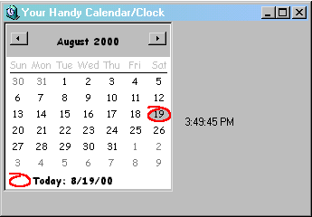



## Calandar and Clock

### Description

This is pretty useful, it shows a calander and a clock, D/L it, use it, have fun, oh and it also can teach you to use a clock i guess, and if you like plz Vote!
 
### More Info
 
dont screw it over while programming it

             |
---                |---
**Submitted On**   |2000-08-19 15:56:52
**By**             |[N/A](https://github.com/Planet-Source-Code/PSCIndex/blob/master/ByAuthor/empty.md)
**Level**          |Beginner
**User Rating**    |3.5 (28 globes from 8 users)
**Compatibility**  |VB 3\.0, VB 4\.0 \(16\-bit\), VB 4\.0 \(32\-bit\), VB 5\.0, VB 6\.0, VB Script, ASP \(Active Server Pages\) 
**Category**       |[Complete Applications](https://github.com/Planet-Source-Code/PSCIndex/blob/master/ByCategory/complete-applications__1-27.md)
**World**          |[Visual Basic](https://github.com/Planet-Source-Code/PSCIndex/blob/master/ByWorld/visual-basic.md)
**Archive File**   |[CODE\_UPLOAD91328192000\.zip](https://github.com/Planet-Source-Code/calandar-and-clock__1-10833/archive/master.zip)

